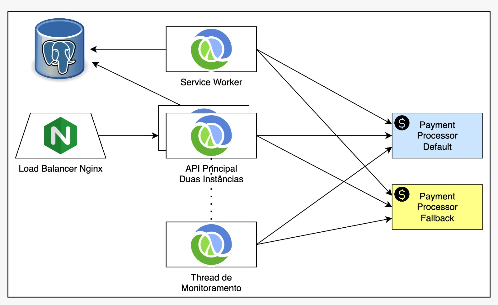
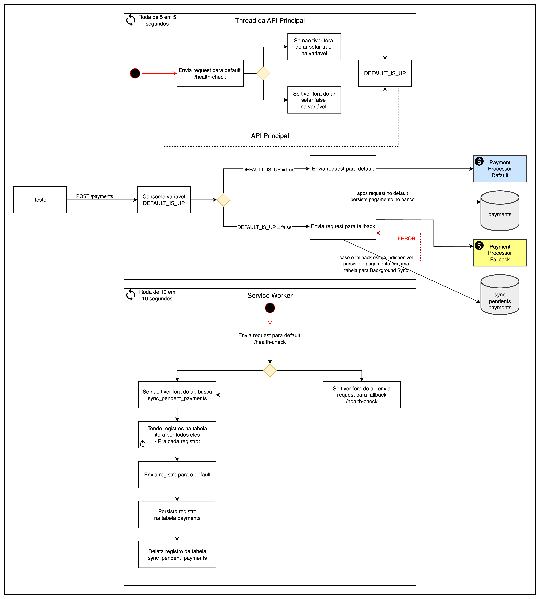
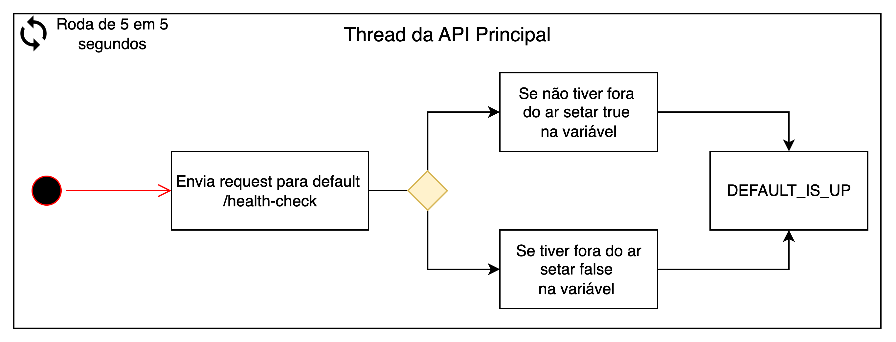
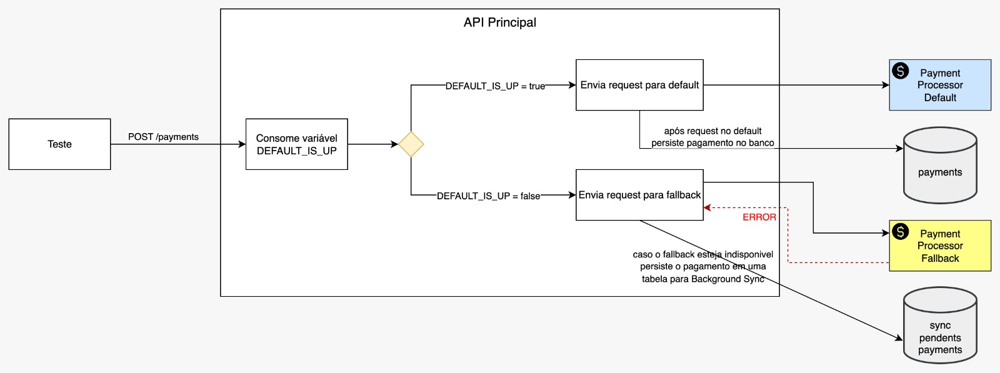
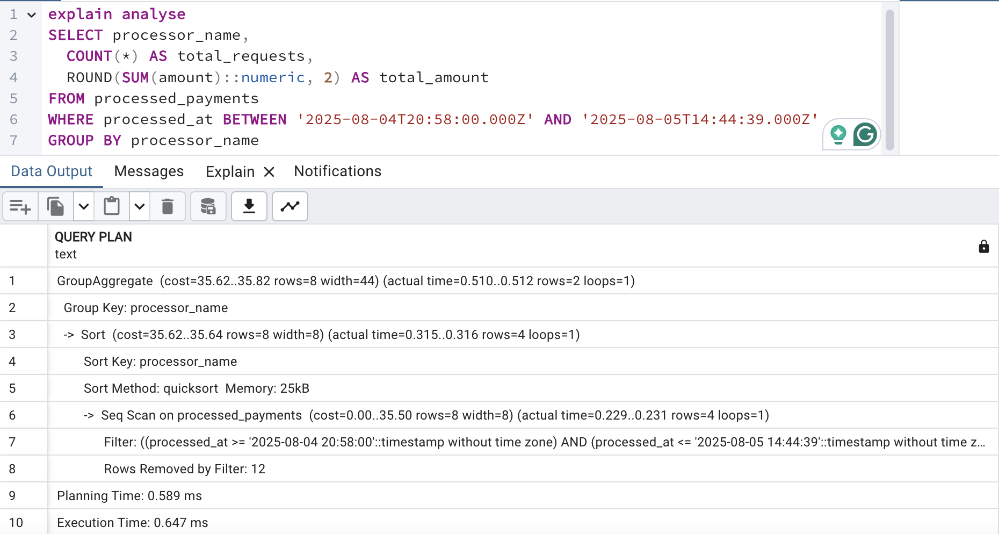
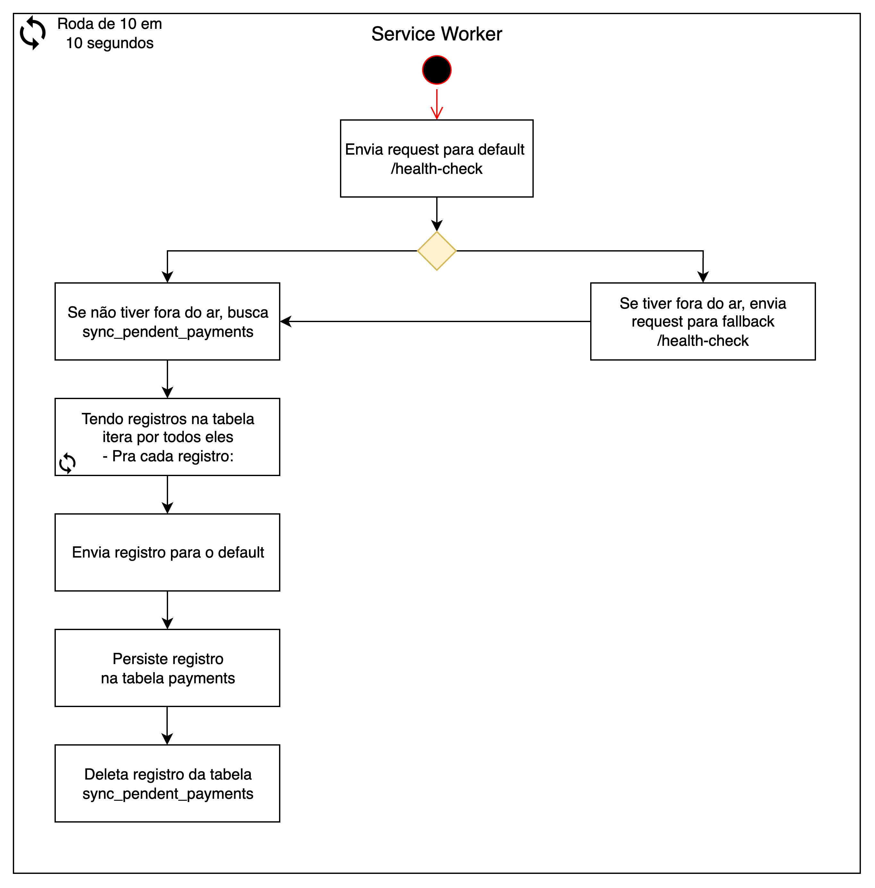

# Desafio
Desenvolver um sistema que vai intermediar solicitações de pagamentos para **dois payment-processors** (default e fallback), cada request para os gateways possui um custo, e o default é o payment-processor mais barato, no entando, durante a execução dos testes, o default irá sofrer instabilidades e chegará até a ficar indisponível, para estes casos temos o fallback, que possui um custo mais caro, e também poderá ficar indisponível, **e o objetivo dessa 3º edição da Rinha é gastar o menos possível**, quanto mais pagamentos você processar com a menor taxa financeira, melhor

Assim como nas outras edições, a solução precisa ter uma arquitetura mínima de 1 load balancer, 2 instâncias da API e 1 banco de dados, tudo isso deve rodar dentro de uma VM mínima de 1.5 vCPU e 350MB de RAM, e todos os componentes da solução devem rodar em containers Docker via docker-compose.

Link do desafio original: https://github.com/zanfranceschi/rinha-de-backend-2025

Link da minha participação na rinha: https://github.com/zanfranceschi/rinha-de-backend-2025/tree/main/participantes/developerarthur

## Critério de pontuação
A métrica utilizada para definir a pontuação da Rinha de Backend é o lucro líquido total ao final do teste. Sua solução será avaliada com base em:
- Lucro obtido com os pagamentos: quanto mais pagamentos você realizar com a menor taxa financeira possível, maior será seu lucro bruto.
- Inconsistências detectadas: caso haja qualquer divergência identificada pelo Banco Central, você pagará uma multa de 35% sobre o total de lucro bruto.

Além disso, há um critério técnico relacionado à performance:
- Se o p99 das requisições HTTP (incluindo backend e Payment Processors) for abaixo de 11ms, você receberá um bônus percentual sobre o seu lucro final.

# Desenho da solução:
Desenvolvi uma espécie de Circuit Breaker com Thread de Monitoramento e Background Sync utilizando Clojure com Pedestal I/O e JDBC

# Distribuição de recursos
| Serviço          | CPU (vCPU) | Memória (RAM) |
| ---------------- | ---------- | ------------- |
| Nginx            | 0.15       | 40 MB         |
| API Principal 01 | 0.45       | 90 MB         |
| API Principal 02 | 0.45       | 90 MB         |
| Service Worker   | 0.15       | 30 MB         |
| PostgreSQL       | 0.30       | 100 MB        |

## Arquitetura Lógica 

Abaixo detalhamento dos componentes

- [Thread de Monitoramento](https://github.com/DeveloperArthur/rinha-de-backend-2025/tree/main?tab=readme-ov-file#thread-de-monitoramento)
- [API Principal](https://github.com/DeveloperArthur/rinha-de-backend-2025/tree/main?tab=readme-ov-file#api-principal)
- [Service Worker](https://github.com/DeveloperArthur/rinha-de-backend-2025/tree/main?tab=readme-ov-file#service-worker)

### Thread de Monitoramento

Teremos uma Thread de Monitoramento que irá rodar dentro das duas instâncias da API Principal e periodicamente, de 5 em 5 segundos enviando request para o health-check do payment-processor-default, atualizando um **estado global** (DEFAULT_IS_UP) para `true` ou `false`

### API Principal

A API Principal expõe dois endpoints principais: `POST /payments` e `GET /payments-summary`

Quando a API Principal receber uma solicitação de pagamentos no endpoint `POST /payments`, ela irá validar o estado global (DEFAULT_IS_UP), caso esteja `true` envia a request para o payment-processor-default, caso esteja `false` envia a request para o payment-processor-fallback, o pagamento sendo enviado com sucesso, os dados dele são inseridos na tabela de pagamentos processados, mas caso a comunicação com qualquer um destes falhe, o pagamento será armazenado em uma tabela para **Background Sync**

Quando a API Principal receber uma solicitação para payments-summary a API irá realizar uma query na tabela de pagamentos processados:

### Service Worker
Teremos um Service Worker responsável por fazer o **Background Sync**, irá rodar apartado da API Principal, e periodicamente, de 10 em 10 segundos, buscando os pagamentos pendentes, se houver registros, consulta o health-check do payment-processor-default, se o serviço estiver UP, envia o pagamento para o default, se não encaminha para o fallback, após encaminhar com sucesso para algum payment-processor, deleta o pagamento da tabela de pendentes e insere na tabela de pagamentos processados

